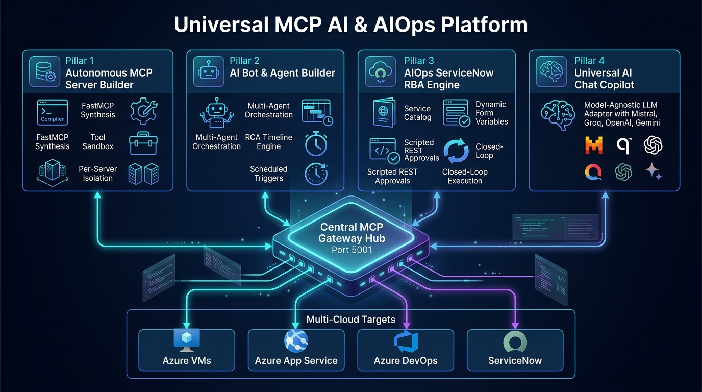
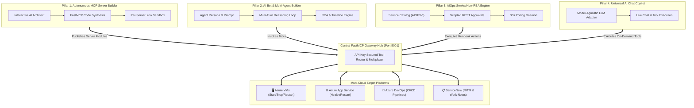

# 🌐 DevOps AI Farm & Universal MCP Platform
> **Enterprise Multi-Agent Orchestrator, FastMCP Server Builder, AIOps ServiceNow Runbook Automation (RBA), and Model-Agnostic AI Copilot.**

[](https://ai-mcp-platform-shakil.azurewebsites.net)
[](https://github.com/modelcontextprotocol)
[](https://service-now.com)
[](https://mistral.ai)
[](LICENSE)

---

## 🏛️ System Architecture



### 📊 End-to-End Governance & Execution Flow


---

## 🌟 The 4 Core Platform Pillars

### 1. ⚙️ Autonomous MCP Server Builder
* **Interactive AI Architect**: Design new Model Context Protocol (FastMCP) tools through natural language conversations.
* **Zero-Touch Code Generation**: Automatically writes deterministic `@mcp.tool` Python server code with strict parameter validation.
* **Per-Server Isolation**: Dedicated `.env` credential scoping per server preventing secret leakage.
* **Built-in Tool Sandbox**: Real-time interactive execution and validation before deployment.

### 2. 🤖 AI Bot & Multi-Agent Builder
* **Multi-Agent Orchestration**: Create autonomous background watchdogs with custom system prompts, goals, and mounted MCP toolsets.
* **RCA & Step Timeline Trace**: Visual multi-step timeline tracing capturing exact thought processes, tool arguments, and outputs.
* **Autonomous Execution Loop**: Handles multi-turn tool calling until objectives are fully verified.
* **Automated Scheduling**: Support for one-shot runs, webhook triggers, and recurring cron schedules.

### 3. ⚡ AIOps ServiceNow Runbook Automation (RBA)
* **Visual Service Catalog Builder**: Create enterprise catalog items (`sc_cat_item`) with dynamic form variables (`item_option_new`, `question_choices`) and clean responsive HTML card layouts.
* **Scripted REST Approval Engine**: Server-side GlideRecord integration ensuring designated approvers (`SOP_APPROVER`) are bound to approval records (`sysapproval_approver`).
* **30s Background Polling Daemon**: Continuously polls ServiceNow for approved requests (`approval=approved`).
* **Closed-Loop Execution**: Validates pre-flight state, executes actions via MCP tools, polls post-execution power states, updates Work Notes, and auto-closes tickets (`Closed Complete`).

### 4. 💬 Universal AI Chat Copilot
* **Model-Agnostic LLM Adapter**: Seamlessly switch providers on the fly:
  * 🌪️ **Mistral AI** (`codestral-latest`, `mistral-small-latest`)
  * ⚡ **Groq Cloud** (`llama-3.3-70b-versatile`)
  * 🧠 **OpenAI / Azure OpenAI** (`gpt-4o`, `gpt-4o-mini`)
  * ✨ **Google Gemini** (`gemini-1.5-pro`, `gemini-1.5-flash`)
  * 🦙 **Self-Hosted Ollama** (`qwen2.5-coder`, `mistral:7b`)
* **Real-Time Tool Invocation**: Call live cloud and ITSM tools directly within conversational streams.

---

## 📂 Repository Structure

```text
devops-ai-farm/
├── aiops-snow/                   # AIOps ServiceNow Polling & Execution Engine
│   ├── aiops_engine.py           # Polling daemon, approval watcher & cloud executor
│   ├── catalog_manager.py        # Visual catalog builder & HTML card formatter
│   └── snow_client.py            # ServiceNow Table & Scripted REST API client
├── docs/                         # Architecture diagrams & interactive HTML
│   ├── full_platform_architecture.jpg
│   ├── full_platform_architecture.html
│   ├── aiops_architecture.jpg
│   └── aiops_architecture.html
├── infra/                        # Infrastructure-as-Code (Bicep)
│   ├── main.bicep                # Azure App Service Plan & Web App Bicep
│   └── parameters.json           # Resource Group & App Service parameters
├── mcp_servers/                  # Isolated FastMCP Server implementations
│   ├── azure_virtual_machines/   # Start, Deallocate (₹0), Restart, Status Polling
│   ├── azure_app_service/        # App Service restart & HTTP 200 health check
│   ├── azure_devops/             # Pipelines, builds, and release management
│   └── servicenow/               # Approvals, incident triage & work notes
├── pipelines/                    # Azure DevOps CI/CD Pipelines
│   ├── azure-pipelines-infra-deploy.yml
│   ├── azure-pipelines-infra-destroy.yml
│   └── azure-pipelines-app-deploy.yml
├── templates/
│   └── index.html                # Unified Modern Web Console (Quill Snow, Dashboards)
├── app.py                        # Central Flask Orchestrator & API Routes
├── bot_engine.py                 # Autonomous Multi-Agent Loop & RCA Timeline
├── gateway_manager.py            # Central FastMCP Gateway Router (Port 5001)
├── llm_adapter.py                # Model-Agnostic Universal LLM Client
├── mistral_service.py            # Interactive MCP Tool Code Architect
└── requirements.txt              # Production Python Dependencies
```

---

## 🚀 Quickstart Guide

### 1. Local Setup
```bash
# Clone the repository
git clone https://github.com/shakilmunavary/devops-ai-farm.git
cd devops-ai-farm

# Create virtual environment
python -m venv venv
source venv/bin/activate  # On Windows: venv\Scriptsctivate

# Install dependencies
pip install -r requirements.txt

# Run the central platform
python app.py
```
Open **`http://localhost:5000`** in your browser.

### 2. Configure Environment Variables
Copy `.env.example` to `.env` and configure your credentials:
```env
# LLM Provider Configuration
LLM_PROVIDER=mistral
LLM_MODEL=codestral-latest
MISTRAL_API_KEY=your_mistral_api_key

# ServiceNow Credentials
SNOW_INSTANCE=dev392242.service-now.com
SNOW_USER=mcp_admin
SNOW_PASSWORD=your_password

# Azure Credentials
AZURE_TENANT_ID=your_tenant_id
AZURE_CLIENT_ID=your_client_id
AZURE_CLIENT_SECRET=your_client_secret
AZURE_SUBSCRIPTION_ID=your_subscription_id
AZURE_RESOURCE_GROUP=RG-DEVOPS-UAENORTH

# Gateway Security
GATEWAY_API_KEY=mcp_live_key_dev_2026
```

---

## 🛡️ Governance & Safety Design

* **Cost Optimization**: Azure VM stop operations use `deallocate` to release compute hardware and ensure **₹0 ongoing compute charge**.
* **Role-Based Approvals**: High-risk actions require designated approver approval (`SOP_APPROVER`) in ServiceNow before execution.
* **Audit Trail**: Every execution records pre-state, duration, tool outputs, and final status directly to ServiceNow RITM Work Notes.

---

## 📄 License
This project is licensed under the Apache 2.0 License - see the [LICENSE](LICENSE) file for details.
